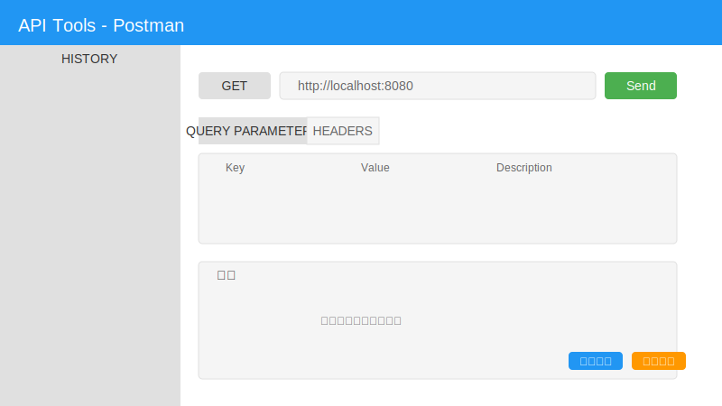
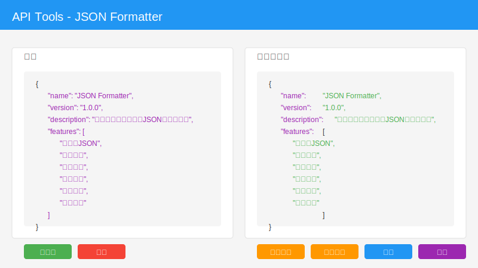
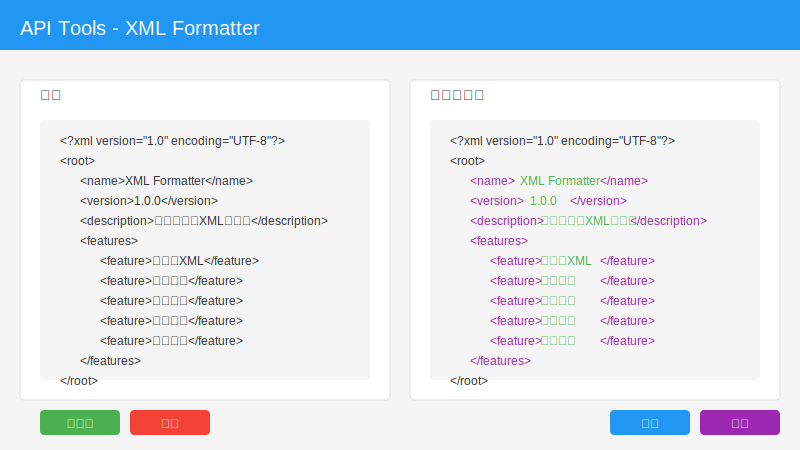

# API Tools Chrome Extension

## 中文文档

### 项目简介
API Tools 是一个轻量级的Chrome浏览器扩展，提供了API测试（类似Postman）、JSON格式化和XML格式化功能，帮助开发者更高效地进行API开发和调试。

### 快速开始

#### 安装步骤
1. 打开Chrome浏览器，访问 `chrome://extensions/`
2. 开启右上角的"开发者模式"开关
3. 点击"加载已解压的扩展程序"
4. 选择项目的 `src/` 文件夹
5. 插件安装完成，浏览器会显示成功提示

#### 基本使用
1. 安装完成后，点击Chrome浏览器工具栏中的API Tools图标
2. 在弹出的窗口中，点击"Open Formatter"按钮打开主功能页面
3. 在主功能页面中，选择需要的功能标签页：
   - **Postman** - 用于测试HTTP/HTTPS API
   - **JSON** - 用于格式化和验证JSON数据
   - **XML** - 用于格式化和验证XML数据

### 使用教程

#### Postman API测试教程
1. **选择HTTP方法**：从下拉菜单中选择GET、POST、PUT、DELETE或PATCH
2. **输入URL**：在URL输入框中输入完整的API地址
3. **添加Query Parameters**（可选）：
   - 点击"Add Parameter"按钮添加参数
   - 填写Key和Value
   - 可添加多个参数
4. **添加Headers**（可选）：
   - 点击"Add Header"按钮添加头部信息
   - 填写Key和Value
   - 默认已添加Content-Type: application/json
5. **配置Body**（对于POST、PUT、PATCH请求）：
   - 选择Body类型：Raw、Form-Data、x-www-form-urlencoded或File
   - 对于Raw类型，选择格式（JSON、XML或Text）并输入内容
   - 对于Form-Data，添加键值对，可选择Text或File类型
   - 对于x-www-form-urlencoded，添加键值对
   - 对于File，选择本地文件
6. **发送请求**：点击"Send"按钮
7. **查看响应**：在响应区域查看状态码、响应时间、响应大小和响应内容
8. **管理历史记录**：左侧历史记录面板可查看和管理之前的请求

#### JSON格式化教程
1. **输入JSON**：在左侧输入框中粘贴或输入JSON字符串
2. **自动格式化**：系统会自动格式化并在右侧显示结果
3. **折叠/展开**：点击三角形图标可折叠或展开嵌套结构
4. **复制**：点击"复制"按钮复制格式化后的JSON
5. **下载**：点击"下载"按钮将JSON保存为文件
6. **查看统计**：底部显示JSON的统计信息（键值对数量、数组对象数量等）

#### XML格式化教程
1. **输入XML**：在左侧输入框中粘贴或输入XML字符串
2. **自动格式化**：系统会自动格式化并在右侧显示结果
3. **复制**：点击"复制"按钮复制格式化后的XML
4. **下载**：点击"下载"按钮将XML保存为文件

### 功能特性

#### 🚀 核心功能
- **API测试** - 类似Postman的HTTP/HTTPS请求测试工具
- **JSON格式化** - 自动格式化、语法高亮、错误验证、折叠展开
- **XML格式化** - 自动格式化、语法高亮、错误验证

#### 📱 API测试功能
- 支持多种HTTP方法：GET、POST、PUT、DELETE、PATCH
- 支持Query Parameters、Headers和Body配置
- 支持多种Body类型：Raw、Form-Data、x-www-form-urlencoded、File
- 实时显示响应状态、响应时间和响应大小
- 请求历史记录管理

#### 📄 JSON格式化功能
- 自动检测和格式化JSON内容
- 语法高亮显示（不同类型使用不同颜色）
- 错误验证和详细错误信息
- 折叠/展开功能，支持嵌套结构的查看
- 一键复制和下载功能
- 统计信息（键值对数量、数组对象数量等）

#### 📄 XML格式化功能
- 自动检测和格式化XML内容
- 语法高亮显示（标签、属性、文本等）
- 错误验证和详细错误信息
- 一键复制和下载功能

#### 📱 API测试功能
- 支持多种HTTP方法：GET、POST、PUT、DELETE、PATCH
- 支持Query Parameters、Headers和Body配置
- 支持多种Body类型：Raw、Form-Data、x-www-form-urlencoded、File
- 实时显示响应状态、响应时间和响应大小
- 请求历史记录管理

#### 📄 JSON格式化功能
- 自动检测和格式化JSON内容
- 语法高亮显示（不同类型使用不同颜色）
- 错误验证和详细错误信息
- 折叠/展开功能，支持嵌套结构的查看
- 一键复制和下载功能
- 统计信息（键值对数量、数组对象数量等）

#### 📄 XML格式化功能
- 自动检测和格式化XML内容
- 语法高亮显示（标签、属性、文本等）
- 错误验证和详细错误信息
- 一键复制和下载功能

## 技术架构

### 项目结构
```
api-tools/
├── src/                      # 源代码目录
│   ├── manifest.json         # Chrome插件配置文件
│   ├── background.js         # 后台脚本
│   ├── content.js            # 内容脚本
│   ├── formatter.html        # 主功能页面
│   ├── formatter.js          # 核心功能逻辑
│   ├── popup.html            # 弹出窗口
│   ├── popup.js              # 弹出窗口脚本
│   └── icons/                # 插件图标
├── icons/                    # 插件图标
├── test/                     # 测试文件
├── README.md                 # 项目说明
└── api-tools-extension.zip   # 打包的扩展
```

### 核心技术
- **纯JavaScript** - 不依赖外部库，轻量级实现
- **Chrome Extension API** - 使用Manifest V3标准
- **CSS3** - 现代化的样式和动画
- **DOM操作** - 高效的页面内容处理

## 安装方法

### 开发模式安装
1. 打开Chrome浏览器，访问 `chrome://extensions/`
2. 开启右上角的"开发者模式"开关
3. 点击"加载已解压的扩展程序"
4. 选择项目的 `src/` 文件夹
5. 插件安装完成，浏览器会显示成功提示

### 测试使用
1. 点击浏览器工具栏中的API Tools图标
2. 在弹出的窗口中选择需要的功能（Postman、JSON或XML）
3. 测试各项功能

## 使用说明

### API测试
1. 在Postman标签页中，选择HTTP方法（GET、POST等）
2. 输入请求URL
3. 配置Query Parameters（可选）
4. 配置Headers（可选）
5. 配置Body（对于POST、PUT、PATCH请求）
6. 点击"Send"按钮发送请求
7. 查看响应结果和统计信息

### JSON格式化
1. 在JSON标签页中，粘贴JSON字符串到输入框
2. 系统会自动格式化并显示结果
3. 使用折叠/展开功能查看嵌套结构
4. 点击"复制"按钮复制格式化后的内容
5. 点击"下载"按钮保存为文件

### XML格式化
1. 在XML标签页中，粘贴XML字符串到输入框
2. 系统会自动格式化并显示结果
3. 点击"复制"按钮复制格式化后的内容
4. 点击"下载"按钮保存为文件

## 开发和贡献

### 开发环境
- Chrome浏览器（最新版本）
- 文本编辑器或IDE
- 无其他依赖

### 开发流程
1. 克隆或下载项目
2. 在Chrome中加载开发版本
3. 修改源代码
4. 在扩展程序页面点击"重新加载"
5. 测试功能

### 代码结构
- **formatter.js** - 核心功能逻辑，包含API测试、JSON和XML格式化
- **formatter.html** - 主功能页面，包含三个标签页
- **popup.js** - 弹出窗口脚本，提供简单的JSON格式化
- **manifest.json** - 插件配置

### 功能预览

#### Postman API测试功能


#### JSON格式化功能


#### XML格式化功能


## 许可证

MIT License - 详见 LICENSE 文件

## 作者和贡献者

- 作者：[开发者姓名]
- 创建日期：2026年
- 版本：1.0.0

## 联系方式

如有问题或建议，请通过以下方式联系：
- 提交Issue
- 发送邮件
- 提交Pull Request

---

**注意**：这是一个实验性项目，可能存在未完全测试的边界情况。请在生产环境中谨慎使用。

---

## English Documentation

### Project Introduction
API Tools is a lightweight Chrome browser extension that provides API testing (similar to Postman), JSON formatting, and XML formatting features to help developers more efficiently conduct API development and debugging.

### Quick Start

#### Installation Steps
1. Open Chrome browser and go to `chrome://extensions/`
2. Enable "Developer mode" in the top right corner
3. Click "Load unpacked"
4. Select the project's `src/` folder
5. The extension is installed, and the browser will show a success message

#### Basic Usage
1. After installation, click the API Tools icon in the Chrome toolbar
2. In the popup window, click the "Open Formatter" button to open the main functionality page
3. In the main functionality page, select the desired feature tab:
   - **Postman** - For testing HTTP/HTTPS APIs
   - **JSON** - For formatting and validating JSON data
   - **XML** - For formatting and validating XML data

### Usage Tutorial

#### Postman API Testing Tutorial
1. **Select HTTP Method**: Choose GET, POST, PUT, DELETE, or PATCH from the dropdown menu
2. **Enter URL**: Input the complete API address in the URL input box
3. **Add Query Parameters** (optional):
   - Click "Add Parameter" button to add parameters
   - Fill in Key and Value
   - Multiple parameters can be added
4. **Add Headers** (optional):
   - Click "Add Header" button to add header information
   - Fill in Key and Value
   - Content-Type: application/json is added by default
5. **Configure Body** (for POST, PUT, PATCH requests):
   - Select Body type: Raw, Form-Data, x-www-form-urlencoded, or File
   - For Raw type, select format (JSON, XML, or Text) and enter content
   - For Form-Data, add key-value pairs, select Text or File type
   - For x-www-form-urlencoded, add key-value pairs
   - For File, select local file
6. **Send Request**: Click the "Send" button
7. **View Response**: Check status code, response time, response size, and response content in the response area
8. **Manage History**: View and manage previous requests in the left history panel

#### JSON Formatting Tutorial
1. **Input JSON**: Paste or enter JSON string in the left input box
2. **Auto Format**: The system will automatically format and display the result on the right
3. **Collapse/Expand**: Click the triangle icon to collapse or expand nested structures
4. **Copy**: Click "Copy" button to copy the formatted JSON
5. **Download**: Click "Download" button to save JSON as a file
6. **View Statistics**: JSON statistics (number of key-value pairs, array objects, etc.) are displayed at the bottom

#### XML Formatting Tutorial
1. **Input XML**: Paste or enter XML string in the left input box
2. **Auto Format**: The system will automatically format and display the result on the right
3. **Copy**: Click "Copy" button to copy the formatted XML
4. **Download**: Click "Download" button to save XML as a file

### Features

#### 🚀 Core Features
- **API Testing** - Postman-like HTTP/HTTPS request testing tool
- **JSON Formatting** - Auto-formatting, syntax highlighting, error validation, collapsible view
- **XML Formatting** - Auto-formatting, syntax highlighting, error validation

#### 📱 API Testing Features
- Support for multiple HTTP methods: GET, POST, PUT, DELETE, PATCH
- Support for Query Parameters, Headers, and Body configuration
- Support for multiple Body types: Raw, Form-Data, x-www-form-urlencoded, File
- Real-time display of response status, response time, and response size
- Request history management

#### 📄 JSON Formatting Features
- Auto-detection and formatting of JSON content
- Syntax highlighting (different colors for different types)
- Error validation and detailed error messages
- Collapse/expand functionality for nested structures
- One-click copy and download functionality
- Statistics (number of key-value pairs, array objects, etc.)

#### 📄 XML Formatting Features
- Auto-detection and formatting of XML content
- Syntax highlighting (tags, attributes, text, etc.)
- Error validation and detailed error messages
- One-click copy and download functionality

## Technical Architecture

### Project Structure
```
api-tools/
├── src/                      # Source code directory
│   ├── manifest.json         # Chrome extension configuration file
│   ├── background.js         # Background script
│   ├── content.js            # Content script
│   ├── formatter.html        # Main functionality page
│   ├── formatter.js          # Core functionality logic
│   ├── popup.html            # Popup window
│   ├── popup.js              # Popup window script
│   └── icons/                # Extension icons
├── icons/                    # Extension icons
├── test/                     # Test files
├── README.md                 # Project documentation
└── api-tools-extension.zip   # Packaged extension
```

### Core Technologies
- **Pure JavaScript** - No external dependencies, lightweight implementation
- **Chrome Extension API** - Using Manifest V3 standard
- **CSS3** - Modern styles and animations
- **DOM Manipulation** - Efficient page content processing

## Installation

### Development Mode Installation
1. Open Chrome browser and go to `chrome://extensions/`
2. Enable "Developer mode" in the top right corner
3. Click "Load unpacked"
4. Select the project's `src/` folder
5. The extension is installed, and the browser will show a success message

### Testing
1. Click the API Tools icon in the browser toolbar
2. Select the desired functionality (Postman, JSON, or XML) in the popup window
3. Test the features

## Usage Instructions

### API Testing
1. In the Postman tab, select the HTTP method (GET, POST, etc.)
2. Enter the request URL
3. Configure Query Parameters (optional)
4. Configure Headers (optional)
5. Configure Body (for POST, PUT, PATCH requests)
6. Click the "Send" button to send the request
7. View the response results and statistics

### JSON Formatting
1. In the JSON tab, paste the JSON string into the input box
2. The system will automatically format and display the result
3. Use the collapse/expand functionality to view nested structures
4. Click the "Copy" button to copy the formatted content
5. Click the "Download" button to save as a file

### XML Formatting
1. In the XML tab, paste the XML string into the input box
2. The system will automatically format and display the result
3. Click the "Copy" button to copy the formatted content
4. Click the "Download" button to save as a file

## Development and Contribution

### Development Environment
- Chrome browser (latest version)
- Text editor or IDE
- No other dependencies

### Development Process
1. Clone or download the project
2. Load the development version in Chrome
3. Modify the source code
4. Click "Reload" on the extensions page
5. Test the functionality

### Code Structure
- **formatter.js** - Core functionality logic, including API testing, JSON and XML formatting
- **formatter.html** - Main functionality page, containing three tabs
- **popup.js** - Popup window script, providing simple JSON formatting
- **manifest.json** - Extension configuration

### Feature Preview

#### Postman API Testing Feature


#### JSON Formatting Feature


#### XML Formatting Feature


## License

MIT License - See LICENSE file for details

## Authors and Contributors

- Author: [Developer Name]
- Creation Date: 2026
- Version: 1.0.0

## Contact

For questions or suggestions, please contact through:
- Submit an Issue
- Send an email
- Submit a Pull Request

---

**Note**: This is an experimental project and may have untested edge cases. Please use with caution in production environments.
